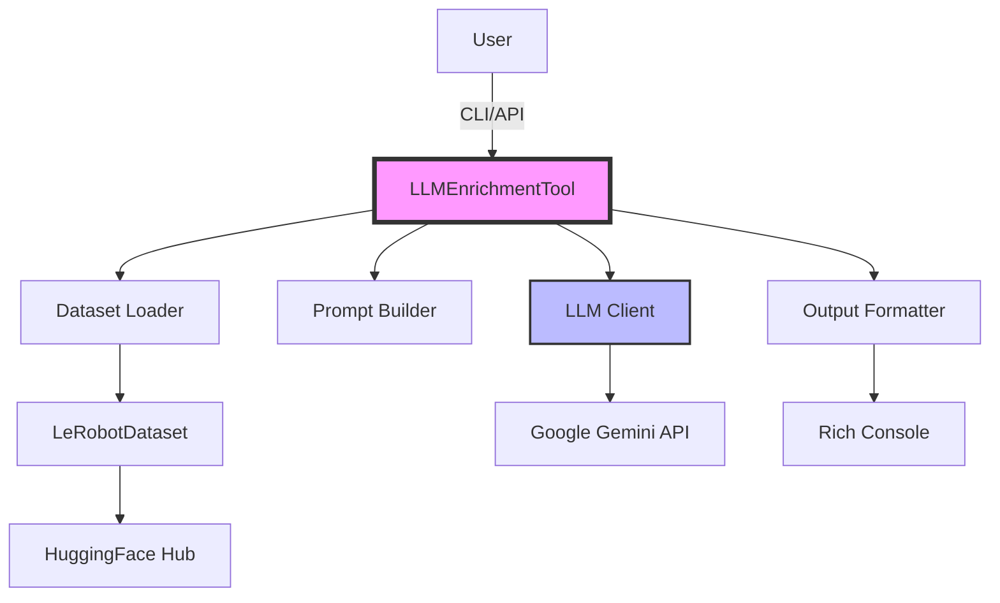

# Technical Design Document: LeRobot LLM Enrichment Tool

## Overview

This document provides detailed technical specifications for the LeRobot LLM enrichment tool, including architecture decisions, implementation details, and design rationale.

## System Architecture

### Component Diagram


### Class Structure

```python
class LLMEnrichmentTool:
    """Main class for dataset enrichment"""
    
    def __init__(self, model_name: str, api_key: str | None)
        # Initialize LLM client
        # Set up console for output
    
    def summarize(self, dataset_repo_id: str, episode_index: int)
        # Extract episode data
        # Build trajectory description
        # Generate summary via LLM
        # Format and display output
    
    def generate_negatives(self, dataset_repo_id: str)
        # Extract unique tasks
        # Generate negative examples for each
        # Format and display results
```

## Data Flow

### Trajectory Summarization Flow

1. **Dataset Loading**
   ```python
   dataset = LeRobotDataset(dataset_repo_id)
   ```

2. **Episode Extraction**
   ```python
   from_idx = dataset.episode_data_index["from"][episode_index].item()
   to_idx = dataset.episode_data_index["to"][episode_index].item()
   episode_data = dataset.hf_dataset.select(range(from_idx, to_idx))
   ```

3. **Feature Analysis**
   - Extract task information
   - Calculate episode statistics (length, duration)
   - Identify available modalities
   - Sample key frames for analysis

4. **Prompt Construction**
   - Structured template with:
     - Task description
     - Episode metadata
     - Feature information
     - Sample data points
     - Analysis instructions

5. **LLM Processing**
   - Send prompt to Gemini API
   - Handle response with safety settings
   - Extract generated text

6. **Output Formatting**
   - Rich console panels
   - Color-coded text
   - Structured layout

### Negative Example Generation Flow

1. **Task Extraction**
   ```python
   unique_tasks = list(set(dataset.meta.tasks.values()))
   ```

2. **Iterative Generation**
   - For each unique task:
     - Build task-specific prompt
     - Request negative examples
     - Store results

3. **Batch Processing**
   - Collect all results
   - Format for display
   - Return dictionary for programmatic use

## API Design

### Public Interface

```python
# CLI Interface
python -m lerobot.cli.enrich_with_llm <command> [options]

Commands:
  summarize         Summarize a trajectory
  generate_negatives Generate negative examples

Options:
  --dataset_repo_id  Repository ID on HuggingFace Hub
  --episode_index    Episode to summarize (default: 0)
  --model_name       Gemini model to use
  --api_key          Google API key (optional)
```

### Python API

```python
from lerobot.cli.enrich_with_llm import LLMEnrichmentTool

# Basic usage
tool = LLMEnrichmentTool()
tool.summarize("dataset/id", episode_index=0)

# Advanced usage
tool = LLMEnrichmentTool(
    model_name="gemini-2.5-flash-preview-05-20",
    api_key="your-key"
)
negatives = tool.generate_negatives("dataset/id")
```

## Implementation Details

### LLM Integration

#### Model Configuration
```python
def _setup_generative_model(model_name: str, api_key: str | None):
    # API key resolution (env, .env file, parameter)
    resolved_api_key = api_key or os.environ.get("GOOGLE_API_KEY")
    
    # Safety settings - disable all filters for research
    safety_settings = [
        types.SafetySetting(
            category=f"HARM_CATEGORY_{harm}", 
            threshold="OFF"
        )
        for harm in ["HATE_SPEECH", "DANGEROUS_CONTENT", 
                     "SEXUALLY_EXPLICIT", "HARASSMENT"]
    ]
    
    # Client initialization
    client = genai.Client(api_key=resolved_api_key)
    
    # Return wrapper with consistent interface
    return ModelWrapper(client, model_name, safety_settings)
```

#### Prompt Engineering

**Trajectory Summarization Prompt Structure:**
```
Please provide a comprehensive summary of this robotic trajectory:

{trajectory_description}

Your summary should include:
1. A high-level description of what the robot is doing
2. Key phases or stages of the task
3. Notable patterns in the robot's movements
4. Any interesting observations about the execution

Please be concise but informative.
```

**Negative Example Generation Prompt Structure:**
```
You are a robotics safety and efficiency expert. Your goal is to 
generate a list of "negative examples" for the following robot task:
"{task_description}"

Please provide a list of 3-5 distinct negative examples...
```

### Error Handling

1. **API Key Validation**
   - Check environment variables
   - Load from .env file
   - Raise clear error if missing

2. **Dataset Access**
   - Handle missing datasets
   - Validate episode indices
   - Graceful handling of missing features

3. **API Errors**
   - Rate limiting
   - Network failures
   - Invalid responses

### Performance Considerations

1. **Caching**
   - Dataset metadata cached locally
   - Episode data loaded on demand
   - No redundant API calls

2. **Memory Management**
   - Stream large datasets
   - Process episodes individually
   - Clear buffers after use

3. **API Optimization**
   - Batch requests where possible
   - Use appropriate model for task
   - Implement retry logic

## Testing Strategy

### Unit Tests
- Model initialization
- Prompt construction
- Data extraction logic

### Integration Tests
- Real dataset loading
- API communication
- End-to-end workflows

### Test Data
- Use small public datasets
- Mock API responses for CI/CD
- Validate output format

## Security Considerations

1. **API Key Management**
   - Never log API keys
   - Support multiple input methods
   - Clear from memory after use

2. **Content Safety**
   - Configurable safety settings
   - Default to permissive for research
   - Document potential risks

3. **Data Privacy**
   - Process data locally
   - Only send summaries to API
   - No persistent storage of results

## Deployment

### Package Structure
```
lerobot/
├── cli/
│   ├── __init__.py
│   ├── enrich_with_llm.py
│   └── README_llm_enrichment.md
├── tests/
│   └── test_enrich_with_llm.py
└── examples/
    └── llm_enrichment_demo.py
```

### Dependencies
```toml
[project.optional-dependencies]
llm = [
    "google-generativeai>=0.8.0",
    "python-dotenv>=1.0.0",
]
```

### Installation
```bash
pip install lerobot[llm]
```

## Future Architecture Considerations

### Extensibility Points

1. **LLM Providers**
   - Abstract base class for providers
   - Plugin architecture
   - Configuration system

2. **Analysis Types**
   - Pluggable analysis modules
   - Custom prompt templates
   - Domain-specific analyzers

3. **Output Formats**
   - JSON/YAML export
   - Database integration
   - Web API endpoints

### Scalability

1. **Batch Processing**
   - Parallel episode processing
   - Async API calls
   - Progress tracking

2. **Distributed Processing**
   - Queue-based architecture
   - Worker pools
   - Result aggregation

3. **Caching Layer**
   - Redis for API responses
   - Local disk cache
   - Intelligent invalidation 